# MELI — Piano prossimi 10 Sprint

**Documento:** piano operativo CTO  
**Data:** 26 giugno 2026  
**Durata sprint:** 2 settimane ciascuno (consigliato)  
**Team assumption:** 1–2 dev full-stack + product part-time

> **Regola di sprint:** nessuna nuova feature fuori scope finché gli exit criteria dello sprint corrente non sono verdi.  
> Ogni sprint termina con `npm run build`, demo su iPad Safari, aggiornamento `CHANGELOG.md`.

---

## Panoramica

| Sprint | Nome | Obiettivo | Release target |
|--------|------|-----------|----------------|
| 1 | **Chiusura v0.1 Alpha** | Exit criteria Fase 1 | `v0.1.0` |
| 2 | **Arnie CRUD + dati coerenti** | Gestione colonie completa | `v0.1.1` |
| 3 | **PWA hardening + CI** | Offline affidabile, pipeline | `v0.1.2` |
| 4 | **Regine v1** | Modulo regine operativo | `v0.2.0` |
| 5 | **Trattamenti v1** | Sanitaria e scadenze | `v0.3.0` |
| 6 | **Produzione v1** | Raccolta miele | `v0.3.1` |
| 7 | **Visite + Report base** | Storico e export | `v0.4.0` |
| 8 | **Dashboard live** | Eliminare mock critici | `v0.4.1` |
| 9 | **Capacitor spike iOS** | Camera/GPS nativi | `v0.4.2` |
| 10 | **Beta readiness** | Test, backup, polish v0.5 | `v0.5.0-beta` |

---

## Sprint 1 — Chiusura v0.1 Alpha

**Goal:** rilasciare la prima alpha testabile sul campo (RANU/Aspromonte).

### Scope

| Task | Tipo | Riferimento debt |
|------|------|------------------|
| Wire `TrattamentiCard` in `ArniaDetail` | Fix | TD-04.1 |
| Form modifica arnia (nome, numero, stato) | Feature minima | TD-04.2 |
| Visita `da_sostituire` → aggiorna `arnia.stato` | Fix dati | TD-02.1 |
| Configurazione PWA (manifest, SW, icone) | Infra | TD-07.1 |
| `syncApiarioArnieCount` al bootstrap seed | Fix | TD-02.2 |
| Filtro giro: escludi arnie inattive/morte | Fix | TD-05.1 |
| Empty state `ArniePage` | UX | TD-04.3 |
| Pass documentazione P0 | Docs | TD-09.* |

### Exit criteria

- [ ] Giro 28 arnie completabile offline su iPad (PWA installata)
- [ ] Modifica arnia funzionante
- [ ] Trattamenti visibili in scheda arnia
- [ ] `package.json` → `0.1.0`, tag git, CHANGELOG
- [ ] Demo 30 min con apicoltore pilota senza blocker

### Out of scope

- Creazione/eliminazione arnia
- Modulo Regine UI
- Capacitor

---

## Sprint 2 — Arnie CRUD + dati coerenti

**Goal:** gestione colonie end-to-end senza intervento dev.

### Scope

| Task | Tipo |
|------|------|
| UI creazione arnia (modal + form, sync count apiario) | Feature |
| UI eliminazione arnia con `ConfirmDialog` | Feature |
| Visita → crea/aggiorna record `Regina` se applicabile | Fix dati |
| Toast unificato salvataggio visita (no doppio) | UX |
| Separare mock dashboard da config live | Refactor |
| Test unitari: `visitSaveService`, `computeSaluteScore` | Quality |

### Exit criteria

- [ ] CRUD arnia completo da UI
- [ ] Regina in DB allineata dopo visita
- [ ] ≥ 5 test Vitest verdi
- [ ] Release `v0.1.1`

---

## Sprint 3 — PWA hardening + CI

**Goal:** installazione offline robusta e build verificata automaticamente.

### Scope

| Task | Tipo |
|------|------|
| Strategia cache Dexie-aware (asset + fallback offline) | Infra |
| Gestione `QuotaExceededError` con messaggio UX | UX |
| GitHub Actions: lint + build su PR | CI |
| Compressione foto prima del save (canvas resize) | Performance |
| Fix warning `useLiveQuery` exhaustive-deps | Quality |
| README + docs onboarding aggiornati | Docs |

### Exit criteria

- [ ] App installabile, riapribile offline dopo kill browser
- [ ] CI verde su main
- [ ] Foto visita ≤ 500 KB tipico
- [ ] Release `v0.1.2`

---

## Sprint 4 — Regine v1

**Goal:** modulo `/regine` operativo per sostituzioni e alert.

### Scope

| Task | Tipo |
|------|------|
| `ReginePage`: lista regine per apiario/arnia | Feature |
| Dettaglio regina: razza, anno, marcatura, storico | Feature |
| Flow sostituzione regina (collegato ad arnia) | Feature |
| Dashboard `regineDaSostituire` → link a lista filtrata | UX |
| Card regina in scheda arnia: link a dettaglio regina | UX |
| Barrel + hooks `useRegine` | Arch |

### Exit criteria

- [ ] `/regine` non più stub
- [ ] Sostituzione regina registrata e visibile in timeline
- [ ] Release `v0.2.0`

---

## Sprint 5 — Trattamenti v1

**Goal:** sanitaria tracciabile con scadenze.

### Scope

| Task | Tipo |
|------|------|
| `TrattamentiPage`: lista filtrabile (arnia, prodotto, data) | Feature |
| Badge scadenza (7/30 giorni) | UX |
| Creazione trattamento manuale (non solo da visita) | Feature |
| KPI dashboard trattamenti: 100% live | Fix |
| Promemoria locali (web Notification API o stub Capacitor) | Feature |

### Exit criteria

- [ ] `/trattamenti` operativo
- [ ] Trattamenti in scadenza visibili e filtrabili
- [ ] Release `v0.3.0`

---

## Sprint 6 — Produzione v1

**Goal:** registrare raccolta miele e totali stagione.

### Scope

| Task | Tipo |
|------|------|
| `ProduzionePage`: form registrazione kg + data + apiario | Feature |
| Aggregazione stagione in dashboard KPI (live) | Fix |
| `ProduzioneChart` alimentato da DB reale | Fix |
| Export parziale produzione in report testo | Feature |

### Exit criteria

- [ ] `/produzione` operativo
- [ ] KPI kg dashboard da IndexedDB
- [ ] Release `v0.3.1`

---

## Sprint 7 — Visite + Report base

**Goal:** storico visite cross-arnia e primi report exportabili.

### Scope

| Task | Tipo |
|------|------|
| `VisitePage`: lista ultime N visite con filtro apiario/arnia | Feature |
| Rimozione redirect `/visite/nuova` → flusso documentato | UX |
| `ReportPage`: report stagione testo (visite, salute media, produzione) | Feature |
| Export CSV visite | Feature |
| `routeMeta` per path dinamici | Polish |

### Exit criteria

- [ ] `/visite` e `/report` non stub
- [ ] Export almeno `.txt` + `.csv`
- [ ] Release `v0.4.0`

---

## Sprint 8 — Dashboard live

**Goal:** eliminare mock che confondono demo e decisioni operative.

### Scope

| Task | Tipo |
|------|------|
| ApiaryMap: marker da arnie reali (salute → colore) | Feature |
| TodayActivities: generare da visite/trattamenti scadenza | Feature |
| QuickActions: wire camera (web) + nuova visita | UX |
| Refactor `mockDashboard.ts` → solo dati non disponibili | Refactor |
| `PhotoPlaceholder` componente condiviso | Debt |
| `InlineEmpty` componente condiviso | Debt |

### Exit criteria

- [ ] Dashboard ≥ 80% dati live
- [ ] Mappa riflette salute arnie seed
- [ ] Release `v0.4.1`

---

## Sprint 9 — Capacitor spike iOS

**Goal:** validare build nativa iPad con camera/GPS reali.

### Scope

| Task | Tipo |
|------|------|
| Init Capacitor iOS project | Infra |
| Implementare `cameraService` nativo | Device |
| Implementare `gpsService` nativo | Device |
| `platformService` detection nativo vs web | Device |
| Test VisitWizard foto su iPad fisico | QA |
| Documentare build Xcode in `docs/device-services.md` | Docs |

### Exit criteria

- [ ] Build iOS installabile su iPad test
- [ ] Foto visita da camera nativa
- [ ] Release `v0.4.2` (web) + build iOS interna

### Out of scope

- App Store submission
- Android

---

## Sprint 10 — Beta readiness (v0.5)

**Goal:** candidatura beta privata — operatività stagione completa.

### Scope

| Task | Tipo |
|------|------|
| Backup/export JSON completo database | Feature |
| Import JSON (restore) con conferma | Feature |
| Impostazioni page (`/impostazioni` da Altro) | Feature |
| Test e2e flusso giro (Playwright) | Quality |
| Audit accessibilità touch target / contrasto | UX |
| Performance pass bundle split | Perf |
| Security review IndexedDB / foto | Security |
| Release notes v0.5.0-beta | Docs |

### Exit criteria

- [ ] Tutti i moduli core (apiari, arnie, visite, regine, trattamenti, produzione, report) non stub
- [ ] Backup/restore testato
- [ ] e2e giro verde in CI
- [ ] Zero item P0 in TECH_DEBT.md
- [ ] Release `v0.5.0-beta`

---

## Dipendenze tra sprint

```mermaid
flowchart LR
  S1[Sprint 1 v0.1] --> S2[Sprint 2 CRUD]
  S2 --> S3[Sprint 3 PWA/CI]
  S3 --> S4[Sprint 4 Regine]
  S4 --> S5[Sprint 5 Trattamenti]
  S5 --> S6[Sprint 6 Produzione]
  S6 --> S7[Sprint 7 Visite/Report]
  S7 --> S8[Sprint 8 Dashboard]
  S8 --> S9[Sprint 9 Capacitor]
  S9 --> S10[Sprint 10 Beta]
```

**Parallelizzabili (con cautela):**
- Sprint 8 (dashboard) può iniziare in overlap con Sprint 6–7 se mock isolation completata in Sprint 2
- Documentazione: continua trasversale ogni sprint

---

## Cerimonie consigliate

| Ritual | Frequenza | Output |
|--------|-----------|--------|
| Sprint planning | Inizio sprint | Scope locked, debt items assegnati |
| Demo iPad | Fine sprint | Video 5 min + note campo |
| Retro | Fine sprint | Aggiornamento TECH_DEBT.md |
| Release | Fine sprint 1,2,3,4,5,6,7,10 | Tag semver + CHANGELOG |

---

## Rischi e mitigazioni

| Rischio | Probabilità | Mitigazione |
|---------|-------------|-------------|
| Quota IndexedDB foto | Alta | Sprint 3 compression |
| PWA iOS limitazioni camera | Media | Sprint 9 Capacitor fallback |
| Scope creep moduli stub | Alta | Regola "no feature fuori sprint" |
| Single dev bottleneck | Media | Sprint 1–3 focus ridotto, debt S-first |
| Doc drift | Media | Checklist doc in ogni PR template |

---

## KPI di avanzamento

| Metrica | Oggi | Target Sprint 10 |
|---------|------|------------------|
| Moduli non-stub | 3/9 | 8/9 |
| Exit criteria v0.1 | 60% | 100% |
| Test automatizzati | 0 | ≥ 20 |
| Mock dashboard | ~50% | ≤ 20% |
| TECH_DEBT P0 | 4 | 0 |

---

*Documenti correlati: [MVP_CHECKLIST.md](./MVP_CHECKLIST.md) · [TECH_DEBT.md](./TECH_DEBT.md) · [ROADMAP.md](./ROADMAP.md)*
